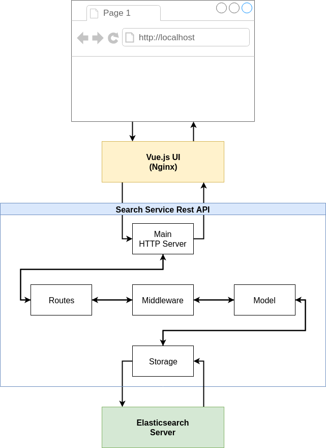

# Search Service Rest API

### Running the service with Docker
Access the service folder and execute the commands

1. Build the image
``` 
docker build -t andreluzz/go-gfg-search-service .
```
2. Run the image
``` 
docker run -it --network="host" andreluzz/go-gfg-search-service
```
> Using --network="host" assuming elasticsearch server is running on the host at port 9200

### Executing the service unit tests
Access the service folder and execute the commands

1. Run the image overriding main command
``` 
docker run -it andreluzz/go-gfg-search-service go test ./... -cover 
```

## Docker Compose
To execute the hole soluction with UI, Elasticsearch Server and Rest API service use docker-compose

``` 
docker-compose up 
```

Access http://localhost to use the UI

## Version and Authentication
Every request should have the headers to define api version and authentication.

For defining the API version use the header: "X-Service-Version" in the request. For test purpose there are two versions available: "v1" and "v2".

Regarding authentication use the header: "Authorization" in the request passing a valid token. For test use the token: "eyJhbGciOiJIUzI1NiIsInR5cCI6IkpXVCJ9.e30.wDWyyGem9YgXDDbH3Un7YYcTB8IcN_BE4BMmS1tvlnE". 

In this implementation was used the JSON Web Token (JWT) to generate the token. If is necessary create other tokens use https://jwt.io/ with the key "top-secret-signin-value-key".

## Solution Architecture


